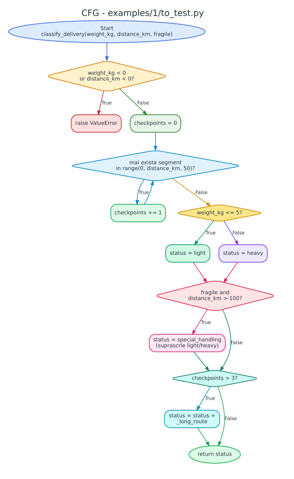
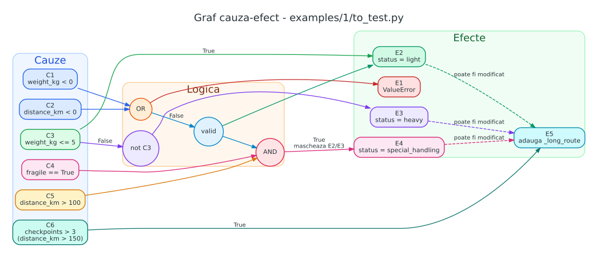
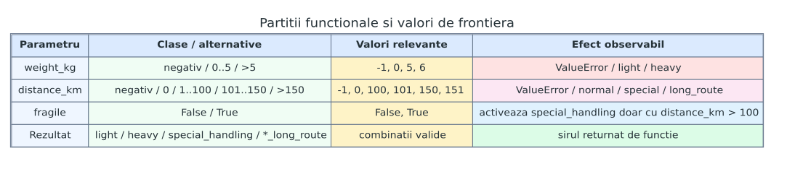
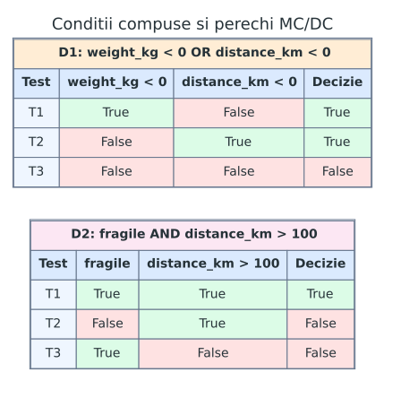
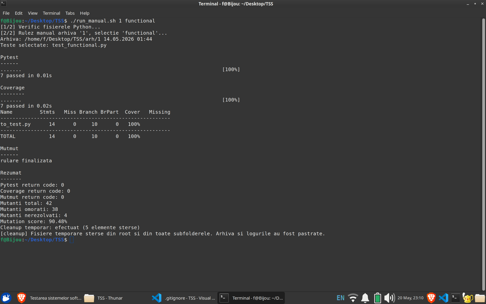
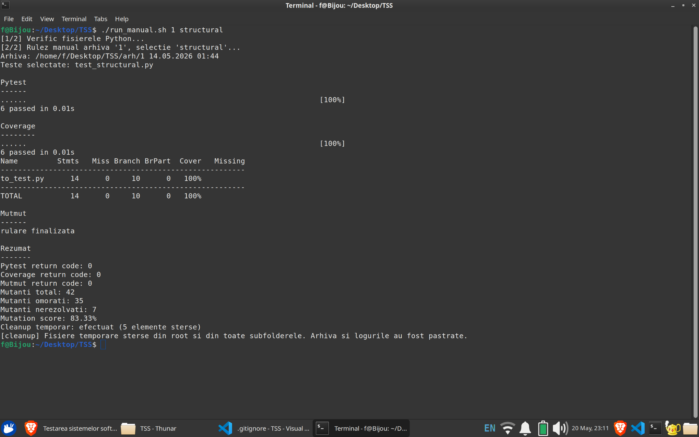
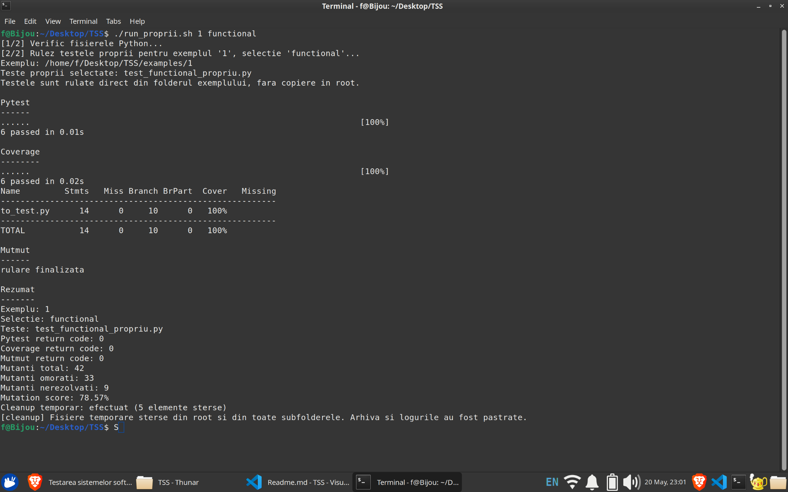
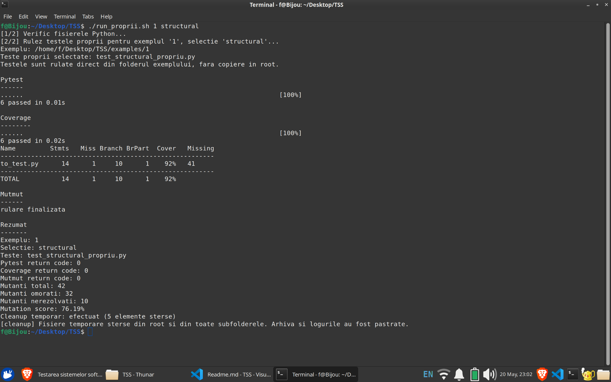

# AutoTesting pentru Testarea Sistemelor Software

## Cuprins

<!-- TOC:START -->
- [1. Scopul aplicatiei](#1-scopul-aplicatiei)
- [2. Configuratia mediului de rulare](#2-configuratia-mediului-de-rulare)
  - [2.1. Configuratie hardware](#21-configuratie-hardware)
  - [2.2. Sistem de operare](#22-sistem-de-operare)
  - [2.3. Masina virtuala](#23-masina-virtuala)
  - [2.4. Versiuni software folosite](#24-versiuni-software-folosite)
  - [2.5. Utilizarea ChatGPT](#25-utilizarea-chatgpt)
- [3. Structura proiectului](#3-structura-proiectului)
- [4. Dependinte](#4-dependinte)
- [5. Configurare](#5-configurare)
- [6. Fisierele de reguli](#6-fisierele-de-reguli)
  - [6.1. `Rules.md`](#61-rulesmd)
  - [6.2. `testing_functional.md`](#62-testing_functionalmd)
  - [6.3. `testing_structural.md`](#63-testing_structuralmd)
- [7. Flux automat cu Ollama](#7-flux-automat-cu-ollama)
- [8. Rulare cu exemple si arhive](#8-rulare-cu-exemple-si-arhive)
  - [8.1. Exemple](#81-exemple)
  - [8.2. Arhive generate](#82-arhive-generate)
- [9. Testare proprie in `examples/`](#9-testare-proprie-in-examples)
- [10. Resetare si curatare workspace](#10-resetare-si-curatare-workspace)
- [11. Comenzi traditionale pentru `pytest`, `coverage.py` si `mutmut`](#11-comenzi-traditionale-pentru-pytest-coveragepy-si-mutmut)
  - [11.1. Teste autogenerate salvate in arhiva](#111-teste-autogenerate-salvate-in-arhiva)
  - [11.2. Teste proprii din `examples/`](#112-teste-proprii-din-examples)
- [12. Analiza pentru `examples/1/to_test.py`](#12-analiza-pentru-examples1to_testpy)
  - [12.1. Fragmente de cod importante pentru testare](#121-fragmente-de-cod-importante-pentru-testare)
  - [12.2. Diagrame](#122-diagrame)
  - [12.3. Capturi de ecran cu rezultatele testarii](#123-capturi-de-ecran-cu-rezultatele-testarii)
  - [12.4. Comparatie tabelara a rezultatelor](#124-comparatie-tabelara-a-rezultatelor)
  - [12.5. Interpretarea rezultatelor](#125-interpretarea-rezultatelor)
  - [12.6. Exemplu de prompt pentru cele trei etape de generare automata](#126-exemplu-de-prompt-pentru-cele-trei-etape-de-generare-automata)
  - [12.7. Observatii despre ecosistemul Ollama si testare](#127-observatii-despre-ecosistemul-ollama-si-testare)
- [13. Loguri si rezultate generate](#13-loguri-si-rezultate-generate)
- [14. Autor](#14-autor)
<!-- TOC:END -->

## 1. Scopul aplicatiei

Aplicatia are ca scop utilizarea inteligentei artificiale pentru imbunatatirea testelor unitare existente si pentru obtinerea unei acoperiri cat mai eficiente a codului sursa. Evaluarea imbunatatirii se face prin doua directii principale: acoperirea codului prin `coverage.py` si eficienta testelor impotriva mutatiilor prin `mutmut`.

Sistemul identifica zonele importante ale functiei testate prin instructiunile de testare definite in fisierele dedicate fiecarei categorii. Pe baza acestor instructiuni, modelul local Ollama propune teste unitare `pytest` pentru functia aflata in `to_test.py`. Testele propuse sunt validate automat si sunt pastrate numai daca sunt corecte si aduc o imbunatatire masurabila fata de suita existenta.

Generarea este impartita in doua categorii:

- `functional`: teste generate in `test_functional.py`, pe baza instructiunilor din `testing_functional.md`, orientate spre comportamentul vizibil al functiei;
- `structural`: teste generate in `test_structural.py`, pe baza instructiunilor din `testing_structural.md`, orientate spre structura codului si spre ramuri greu de acoperit.

Pentru fiecare categorie, performanta este verificata prin:

- `pytest`: confirma ca suita de teste ruleaza corect;
- `coverage.py`: masoara acoperirea instructiunilor si a ramurilor din `to_test.py`;
- `mutmut`: masoara capacitatea testelor de a elimina mutanti.

Optimizarea se opreste independent pentru fiecare categorie atunci cand aceasta ajunge la 100% pentru rularea cu `pytest`, 100% acoperire si 100% mutanti eliminati.

## 2. Configuratia mediului de rulare

Configuratia a fost colectata pe sistemul local de testare la data de 20 mai 2026.

### 2.1. Configuratie hardware

| Componenta | Specificatie |
|---|---|
| Sistem | Laptop Lenovo IdeaPad Pro 5 14AHP9 |
| Procesor | AMD Ryzen 7 8845HS w/ Radeon 780M Graphics |
| Arhitectura | x86-64 |
| Numar procesoare logice | 16 |
| Numar nuclee / fire per nucleu | 8 nuclee / 2 fire per nucleu |
| Frecventa maxima CPU | 5102.7129 MHz |
| Memorie RAM | 13 GiB |
| Swap | 4.0 GiB |
| Stocare principala | SKHynix HFS512GEJ4X112N, 476.9 GiB, NVMe |
| Partitie sistem | ext4, 468 GiB, montata in `/` |
| Placa video | AMD/ATI Phoenix3 |
| Retea wireless | Realtek RTL8852CE PCIe 802.11ax |

### 2.2. Sistem de operare

| Element | Valoare |
|---|---|
| Sistem de operare | Ubuntu 24.04.4 LTS |
| Codename | noble |
| Kernel | Linux 6.17.0-23-generic |
| Arhitectura SO | x86_64 |
| Firmware | NBCN22WW |

### 2.3. Masina virtuala

Nu a fost utilizata o masina virtuala.

### 2.4. Versiuni software folosite

| Componenta | Versiune |
|---|---|
| Python | 3.12.3 |
| pip | 24.0 |
| pytest | 9.0.3 |
| coverage.py | 7.13.5 |
| mutmut | 3.5.0 |
| Ollama | 0.20.2 |
| Model Ollama | qwen2.5-coder:7b |
| Git | 2.43.0 |
| Bash | 5.2.21(1)-release |

Modelul Ollama instalat pentru generarea testelor este `qwen2.5-coder:7b`.

### 2.5. Utilizarea ChatGPT

ChatGPT a fost utilizat ca instrument de asistenta pentru generarea si ajustarea codului, pentru generarea de teste si pentru configurarea ecosistemului local de testare cu Ollama. Codul rezultat ramane validat prin instrumentele proiectului: `pytest`, `coverage.py` si `mutmut`.

## 3. Structura proiectului

```text
AutoTesting.py         # orchestratorul principal
config.py              # configurarea principala a aplicatiei
reset.py               # resetarea fisierelor de lucru
cleanup_temp.py        # stergerea artefactelor temporare din root si subfoldere
manual_testing.py      # rulare manuala pytest / coverage / mutmut in root
run_examples.py        # pregatirea exemplelor din examples/
run_arh_manual.py      # rulare manuala pe folderele salvate in arh/
run_proprii.py         # rulare pytest / coverage / mutmut pe testele proprii din examples/
run_auto.sh            # script shell pentru rularea fluxului automat
run_manual.sh          # script shell pentru rularea manuala pe arhive
run_proprii.sh         # script shell pentru rularea testelor proprii
Rules.md               # reguli generale pentru generarea testelor
testing_functional.md  # instructiuni numerotate pentru teste functionale
testing_structural.md  # instructiuni numerotate pentru teste structurale
to_test.py             # functia curenta testata
test_functional.py     # teste functionale acceptate
test_structural.py     # teste structurale acceptate
test_propunere.py      # fisier temporar pentru candidatul curent
Includes/              # module interne ale framework-ului
examples/              # functii de exemplu si teste proprii
arh/                   # rezultate finale ale rularilor automate
docs/diagrams/         # diagrame Graphviz DOT si SVG
docs/screenshorts/     # capturi de ecran cu rezultatele rularilor
logs/                  # loguri tehnice si dialoguri Ollama
```

## 4. Dependinte

Instalare utilitare Python folosite de proiect:

```bash
python3 -m pip install --user --break-system-packages pytest coverage mutmut
```

Instalare Ollama si model local:

```bash
curl -fsSL https://ollama.com/install.sh | sh
ollama pull qwen2.5-coder:7b
```

Pentru regenerarea diagramelor SVG din fisierele `.dot` este necesar Graphviz:

```bash
sudo apt install graphviz
```

Exemplu de regenerare:

```bash
dot -Tsvg docs/diagrams/example1_cfg.dot -o docs/diagrams/example1_cfg.svg
```

## 5. Configurare

Configurarea principala se afla in `config.py`.

Setari importante:

- `timeouts.timeout_sec`: timeout general pentru comenzi obisnuite si pentru apelul HTTP catre Ollama;
- `timeouts.timeout_sec_mutmut`: timeout separat pentru `mutmut`;
- `timeouts.timeout_categorie_ai_sec`: buget maxim de timp pentru etapa de descoperire dintr-o categorie;
- `timeouts.max_corectie_attempts`: cate corectii se cer pentru o propunere invalida;
- `timeouts.max_empty_answers_consecutive`: cate raspunsuri goale sau inutilizabile consecutive sunt acceptate inainte de renuntare;
- `generation_limits.max_existing_subtype_attempts_without_progress`: cate incercari consecutive fara progres sunt permise pentru acelasi subtip existent;
- `generation_limits.max_discovery_attempts_without_progress`: cate incercari consecutive fara progres sunt permise in etapa de descoperire;
- `generation_limits.max_failed_attempts_kept_per_scope`: cate incercari respinse sunt pastrate ca exemple negative in prompt;
- `ollama.model`: modelul local folosit pentru generare;
- `ollama.temperature`: nivelul de variabilitate al raspunsurilor;
- `terminal.show_ollama_prompt`: afisarea promptului complet in terminal;
- `terminal.show_ollama_response`: afisarea raspunsului brut in terminal;
- `terminal.show_ai_technical_messages`: afisarea mesajelor tehnice despre Ollama;
- `logging.save_ollama_chat`: salvarea dialogului complet in `logs/ollama_chat.log`;
- `logging.save_ollama_prompts`: salvarea prompturilor complete in `logs/ollama_prompts.log`;
- `logging.save_ollama_responses`: salvarea raspunsurilor brute in `logs/ollama_responses.log`.

## 6. Fisierele de reguli

### 6.1. `Rules.md`

Contine regulile generale aplicate tuturor prompturilor. Regulile stabilesc formatul raspunsului Ollama, cerinta de a genera o singura functie `test_*`, interdictia importurilor si cerinta de a folosi asertiuni exacte.

### 6.2. `testing_functional.md`

Contine instructiuni numerotate pentru teste functionale. Testele functionale urmaresc comportamentul vizibil al functiei:

- valori valide;
- valori invalide;
- rezultate returnate;
- exceptii;
- valori limita;
- rezultate speciale;
- efectul argumentelor de tip flag sau boolean.

Fiecare linie numerotata este un subtip independent. Pentru fiecare subtip se genereaza teste cat timp exista progres. Dupa numarul configurat de incercari consecutive fara progres, se trece la subtipul urmator.

### 6.3. `testing_structural.md`

Contine instructiuni numerotate pentru teste structurale. Testele structurale urmaresc caile de executie din cod:

- ramuri `if` si `else`;
- conditii simple;
- conditii compuse cu `and` / `or`;
- bucle cu zero, una sau mai multe iteratii;
- cai de exceptie;
- cai normale de returnare;
- cazuri in care o ramura ulterioara modifica sau nu modifica rezultatul.

## 7. Flux automat cu Ollama

Rulare principala:

```bash
python3 AutoTesting.py
```

Rulare automata pe un exemplu:

```bash
./run_auto.sh 1
./run_auto.sh 2
./run_auto.sh 3
```

`run_auto.sh` executa:

```bash
python3 cleanup_temp.py --root "$ROOT_DIR" --quiet
python3 -m compileall -q AutoTesting.py manual_testing.py reset.py run_examples.py run_arh_manual.py run_proprii.py config.py cleanup_temp.py Includes
python3 run_examples.py <numar_exemplu>
python3 AutoTesting.py
python3 cleanup_temp.py --root "$ROOT_DIR" --quiet
```

Fluxul automat:

1. pregateste exemplul selectat ca `to_test.py` in root;
2. citeste regulile generale si instructiunile categoriei;
3. genereaza teste cu Ollama pentru fiecare categorie;
4. valideaza fiecare candidat cu `pytest`;
5. masoara candidatii acceptabili cu `coverage.py` si `mutmut`;
6. pastreaza doar testele care imbunatatesc cel putin un scor;
7. arhiveaza rezultatele finale in `arh/`.

## 8. Rulare cu exemple si arhive

### 8.1. Exemple

Exemple disponibile:

```bash
python3 run_examples.py list
```

Pregatirea unui exemplu fara pornirea framework-ului automat:

```bash
python3 run_examples.py 1
```

Pregatirea unui exemplu si rularea framework-ului:

```bash
python3 run_examples.py 1 --run-autotesting
```

Rularea tuturor exemplelor:

```bash
python3 run_examples.py all --run-autotesting
```

`run_examples.py` copiaza `examples/<numar>/to_test.py` in root ca `to_test.py`, apoi ruleaza `reset.py` pentru stergerea testelor generate anterior.

### 8.2. Arhive generate

Dupa o rulare automata, fisierele finale sunt salvate in `arh/`, de forma:

```text
arh/1 12.05.2026 19:24/
```

In acest folder sunt salvate fisierele finale relevante:

- `to_test.py`;
- `test_functional.py`;
- `test_structural.py`.

Testarea unei arhive:

```bash
python3 run_arh_manual.py latest all
python3 run_arh_manual.py latest functional
python3 run_arh_manual.py latest structural
```

Rulare prin script shell:

```bash
./run_manual.sh latest all
./run_manual.sh latest functional
./run_manual.sh latest structural
./run_manual.sh 1 all
./run_manual.sh 1 functional
./run_manual.sh 1 structural
```

In interpretarea scriptului, `1` este cea mai veche arhiva disponibila. Valoarea `latest` selecteaza cea mai recenta arhiva.

`run_manual.sh` executa:

```bash
python3 cleanup_temp.py --root "$ROOT_DIR" --quiet
python3 -m compileall -q AutoTesting.py manual_testing.py reset.py run_examples.py run_arh_manual.py run_proprii.py config.py cleanup_temp.py Includes
python3 run_arh_manual.py <arhiva> <selectie>
python3 cleanup_temp.py --root "$ROOT_DIR" --quiet
```

## 9. Testare proprie in `examples/`

Pe langa testele generate automat cu Ollama, proiectul contine si teste scrise manual. Acestea sunt pastrate direct in folderele de exemplu:

```text
examples/1/test_functional_propriu.py
examples/1/test_structural_propriu.py
examples/2/test_functional_propriu.py
examples/2/test_structural_propriu.py
examples/3/test_functional_propriu.py
examples/3/test_structural_propriu.py
```

Aceste teste nu sunt copiate in root. Ele sunt rulate direct din folderul exemplului, cu `to_test.py` local din acel folder.

Rulare prin script shell:

```bash
./run_proprii.sh 1 all
./run_proprii.sh 1 functional
./run_proprii.sh 1 structural
./run_proprii.sh 2 all
./run_proprii.sh 3 all
```

`run_proprii.sh` executa:

```bash
python3 cleanup_temp.py --root "$ROOT_DIR" --quiet
python3 -m compileall -q AutoTesting.py manual_testing.py reset.py run_examples.py run_arh_manual.py run_proprii.py config.py cleanup_temp.py Includes examples
python3 run_proprii.py <numar_exemplu> <selectie>
python3 cleanup_temp.py --root "$ROOT_DIR" --quiet
```

`run_proprii.py` ruleaza pentru selectia ceruta:

1. `pytest`;
2. `coverage.py` cu branch coverage;
3. `mutmut` cu un `pyproject.toml` temporar, limitat la fisierul de test selectat.

## 10. Resetare si curatare workspace

Resetare manuala:

```bash
python3 reset.py
```

Resetarea recreeaza fisierele de lucru:

- `test_functional.py`;
- `test_structural.py`;
- `test_propunere.py`.

Curatarea recursiva a artefactelor temporare din root si din toate subfolderele:

```bash
python3 cleanup_temp.py --root .
```

Verificare fara stergere efectiva:

```bash
python3 cleanup_temp.py --root . --dry-run
```

## 11. Comenzi traditionale pentru `pytest`, `coverage.py` si `mutmut`

Scripturile proiectului automatizeaza rularile, dar aceleasi verificari pot fi executate si direct, cu instrumentele standard.

### 11.1. Teste autogenerate salvate in arhiva

Exemplu pentru categoria functionala din arhiva 1:

```bash
cd "arh/1 14.05.2026 01:44"
python3 -m pytest -q test_functional.py
python3 -m coverage run --branch -m pytest -q test_functional.py
python3 -m coverage report -m to_test.py
cat > pyproject.toml <<'EOF'
[tool.mutmut]
paths_to_mutate = ["to_test.py"]
pytest_add_cli_args_test_selection = ["test_functional.py"]
pytest_add_cli_args = ["-q"]
debug = true
EOF
mutmut run
mutmut results
```

Pentru categoria structurala se foloseste acelasi flux cu `test_structural.py`.

### 11.2. Teste proprii din `examples/`

Exemplu pentru categoria functionala proprie din `examples/1`:

```bash
cd examples/1
python3 -m pytest -q test_functional_propriu.py
python3 -m coverage run --branch -m pytest -q test_functional_propriu.py
python3 -m coverage report -m to_test.py
cat > pyproject.toml <<'EOF'
[tool.mutmut]
paths_to_mutate = ["to_test.py"]
pytest_add_cli_args_test_selection = ["test_functional_propriu.py"]
pytest_add_cli_args = ["-q"]
debug = true
EOF
mutmut run
mutmut results
```

Pentru categoria structurala proprie se foloseste acelasi flux cu `test_structural_propriu.py`.

## 12. Analiza pentru `examples/1/to_test.py`

Fisierul `examples/1/to_test.py` contine functia `classify_delivery(weight_kg, distance_km, fragile)`. Functia clasifica o livrare in functie de greutate, distanta si marcajul `fragile`.

Comportamentul observabil:

- exceptie pentru valori numerice negative;
- clasificare `light` pentru `weight_kg <= 5`;
- clasificare `heavy` pentru `weight_kg > 5`;
- suprascriere cu `special_handling` pentru livrari fragile cu distanta peste 100 km;
- adaugarea sufixului `_long_route` cand ruta are mai mult de 3 checkpoint-uri, adica pentru distante peste 150 km.

Analiza combina testarea functionala cu testarea structurala. Partea functionala foloseste clase de echivalenta, valori de frontiera, partitionare in categorii si graf cauza-efect. Partea structurala foloseste graful de flux de control, acoperirea ramurilor, acoperirea conditiilor si verificarea conditiilor compuse.

### 12.1. Fragmente de cod importante pentru testare

Validarea intrarilor numerice opreste executia inainte de orice clasificare:

```python
if weight_kg < 0 or distance_km < 0:
    raise ValueError("Parametrii numerici nu pot fi negativi.")
```

Bucla pentru checkpoint-uri creeaza o cale repetitiva utila pentru testarea structurala si pentru mutatii:

```python
checkpoints = 0
for _ in range(0, distance_km, 50):
    checkpoints += 1
```

Ramura principala separa livrarile usoare de cele grele:

```python
if weight_kg <= 5:
    status = "light"
else:
    status = "heavy"
```

Conditia compusa pentru livrari fragile poate suprascrie rezultatul calculat anterior:

```python
if fragile and distance_km > 100:
    status = "special_handling"
```

Ramura finala modifica rezultatul anterior prin concatenare:

```python
if checkpoints > 3:
    status = status + "_long_route"
```

### 12.2. Diagrame

Diagramele au fost generate cu Graphviz, pornind de la fisiere sursa `.dot`. Fisierele `.dot` reprezinta forma editabila a diagramelor, iar fisierele `.svg` sunt imaginile incluse in README. Ambele variante sunt pastrate in `docs/diagrams/`.

Regenerarea unei diagrame se face cu:

```bash
dot -Tsvg docs/diagrams/example1_cfg.dot -o docs/diagrams/example1_cfg.svg
```

SVG-urile au fundal deschis si culori explicite pentru noduri, contururi, muchii si text, astfel incat sa ramana lizibile si pe teme intunecate.

#### Graful de flux de control



Aceasta diagrama evidentiaza ordinea executiei, ramurile `if/else`, ramurile fara `else`, bucla pentru checkpoint-uri si calea de iesire prin exceptie.

#### Graful cauza-efect



Aceasta diagrama leaga conditiile de intrare de efectele observabile. Este utila pentru intelegerea suprascrierii `light/heavy` cu `special_handling` si pentru observarea faptului ca `_long_route` modifica rezultatul final dupa calculul statusului initial.

#### Partitii functionale si valori de frontiera



Diagrama rezuma clasele relevante de intrare si valorile de frontiera: `-1`, `0`, `5`, `6`, `100`, `101`, `150`, `151`.

#### Conditii compuse si MC/DC



Diagrama arata combinatiile minime relevante pentru deciziile compuse:

- `weight_kg < 0 or distance_km < 0`;
- `fragile and distance_km > 100`.

### 12.3. Capturi de ecran cu rezultatele testarii

Capturile sunt pastrate in `docs/screenshorts/`.

#### Teste autogenerate - functional



#### Teste autogenerate - structural



#### Teste proprii - functional



#### Teste proprii - structural



### 12.4. Comparatie tabelara a rezultatelor

Tabelele sunt scrise direct in sintaxa Markdown, nu sunt imagini. Valorile din tabel sunt preluate din rularile afisate in capturile de ecran din `docs/screenshorts/`, respectiv din iesirile `pytest`, `coverage.py` si `mutmut`.

| Sursa testelor | Categorie | Fisier testat | Teste trecute | Coverage | Branch-uri | BrPart | Mutanti total | Mutanti omorati | Mutanti nerezolvati | Mutation score |
|---|---:|---|---:|---:|---:|---:|---:|---:|---:|---:|
| Ollama | functional | `test_functional.py` | 7 | 100% | 10 | 0 | 42 | 38 | 4 | 90.48% |
| Ollama | structural | `test_structural.py` | 6 | 100% | 10 | 0 | 42 | 35 | 7 | 83.33% |
| Proprii | functional | `test_functional_propriu.py` | 6 | 100% | 10 | 0 | 42 | 33 | 9 | 78.57% |
| Proprii | structural | `test_structural_propriu.py` | 6 | 92% | 10 | 1 | 42 | 32 | 10 | 76.19% |

### 12.5. Interpretarea rezultatelor

Testele functionale generate de Ollama au obtinut cel mai bun rezultat pe mutatii: `90.48%`. Desi numarul de teste este apropiat de cel al testelor proprii, suita autogenerata functionala a acoperit mai multe cazuri care au diferentiat mutanti semnificativi.

Testele structurale generate de Ollama au obtinut `100%` coverage si `83.33%` mutation score. Rezultatul arata ca acoperirea completa a instructiunilor si ramurilor nu garanteaza eliminarea tuturor mutantilor. Mutatia ramane o masura mai stricta, deoarece verifica daca testele detecteaza modificari artificiale ale codului, nu doar daca executa liniile.

Testele proprii functionale au obtinut `100%` coverage, dar un mutation score mai mic, `78.57%`. Acest lucru indica faptul ca setul propriu acopera toate liniile si ramurile, dar unele asertiuni nu sunt suficient de sensibile pentru a omori toti mutantii relevanti.

Testele proprii structurale au obtinut `92%` coverage. Raportul indica lipsa liniei `41`, adica ramura `else` din clasificarea greutatii:

```python
else:
    status = "heavy"
```

Pentru imbunatatirea testului structural propriu este necesar cel putin un caz care trece explicit prin ramura `heavy`, de exemplu:

```python
assert classify_delivery(6, 100, False) == "heavy"
```

Concluzia principala este ca testele autogenerate au fost mai eficiente pentru primul exemplu, mai ales la scorul de mutatie. Testele proprii au avantajul ca sunt mai usor de explicat si controlat, dar necesita analiza atenta a tuturor ramurilor si a mutantilor supravietuitori.

### 12.6. Exemplu de prompt pentru cele trei etape de generare automata

Prompturile reale sunt construite din mai multe componente: `Rules.md`, instructiunile categoriei, codul din `to_test.py`, testele deja acceptate si istoricul incercarilor respinse. Mai jos sunt exemple sintetice, reprezentative pentru cele trei etape folosite de aplicatie.

#### Etapa 1 - generare pe subtip existent

```text
Task: write exactly one pytest test for the requested instruction.

The requested instruction is the only goal for this answer.
Treat it as a command, not as a topic.
Read the source code, choose concrete input values and write the exact expected result.
If a loop affects the result, trace the loop before writing the assertion.

Category instruction: create tests for visible behavior only.
Functional tests check what the caller can observe: exact returned values or exact raised exceptions.
Use normal inputs, invalid inputs, boundaries, flags and distinct output classes.
Do not target internal implementation details directly.

Requested instruction:
Make one test with a value just above an important boundary and assert the exact returned result.

Output format:
- Return only one Python function.
- The function name must start with test_.
- Do not write imports.
- Do not write helper functions.
- Do not write markdown fences.
- Use the function from to_test.py directly.
- Use assert for returned values.
- Use pytest.raises for expected exceptions.
- Assert exact visible behavior.
```

#### Etapa 2 - descoperire de test nou

```text
Task: write exactly one new pytest test for the current category.

Use the category instruction as a requirement.
The new test must belong to the current category.
The new test must be different from the listed subtypes and from accepted or rejected tests.
Read the source code and choose one concrete behavior or execution path that is not already tested.
For structural tests, focus on execution paths: branches, compound conditions, loops, guards, assignments, missing lines and return paths.

Category instruction: create tests that force specific execution paths inside the function.
Structural tests target branches, compound conditions, loops, guards, assignments and return paths.
The assertion must still check visible behavior, but the chosen input should exercise a specific path.
If coverage reports missing lines, prefer tests that execute those missing lines.
When a loop affects the result, trace the loop manually before writing the expected value.

Output format:
- Return only one Python function.
- The function name must start with test_.
- Do not write imports.
- Do not write helper functions.
- Do not write markdown fences.
- Use the function from to_test.py directly.
- Use exact assertions.
```

#### Etapa 3 - sinteza unei reguli noi

```text
Task: write metadata for an accepted test.

Output format:
- Write one # Rule: line.
- Write one # Reasoning: line.
- The rule must be short, general and reusable.
- If there is no good reusable rule, write an empty rule.

Accepted test:
def test_four_checkpoints_trigger_long_route_branch():
    assert classify_delivery(5, 151, False) == "light_long_route"

Expected metadata:
# Rule: Test the first value after a loop-based threshold changes the final result.
# Reasoning: The test checks the boundary where the loop count becomes large enough to activate a later branch that modifies the returned value.
```

### 12.7. Observatii despre ecosistemul Ollama si testare

Modelul local Ollama functioneaza ca generator de candidati, nu ca sursa finala de adevar. Acceptarea unui test este decisa de ecosistemul de validare: `pytest`, `coverage.py` si `mutmut`.

Separarea intre `functional` si `structural` este utila deoarece cele doua categorii urmaresc obiective diferite. Testele functionale verifica rezultatele observabile, in timp ce testele structurale aleg intrari care forteaza cai specifice prin cod.

Rezultatele pentru primul exemplu arata ca:

- `coverage.py` este necesar, dar nu suficient;
- `mutmut` diferentiaza mai bine calitatea asertiunilor;
- testele generate automat pot descoperi combinatii bune de intrari, dar trebuie pastrate doar dupa validare;
- testele proprii sunt utile ca reper uman si ca baza de comparatie;
- un raport bun trebuie sa includa atat scoruri, cat si interpretarea cauzelor pentru diferentele dintre scoruri.

## 13. Loguri si rezultate generate

Logurile sunt pastrate in `logs/`:

```text
logs/framework.log          # log tehnic general
logs/events.jsonl           # evenimente structurale JSONL
logs/ollama_chat.log        # prompt + raspuns Ollama
logs/ollama_prompts.log     # prompturi complete
logs/ollama_responses.log   # raspunsuri brute Ollama
```

La finalul rularii automate, aplicatia afiseaza:

- numarul de teste acceptate pe categorie;
- performanta finala pentru `functional` si `structural`;
- scorurile `pytest`, `coverage.py` si `mutmut`;
- eventualele reguli noi adaugate in `testing_*.md`.

## 14. Autor

Condruz Filip Gabriel  
Universitatea din Bucuresti, Facultatea de Matematica si Informatica, anul 3 ID
